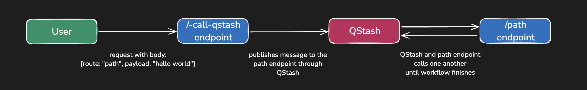

# QStash Workflow Solid.js Example

This project has some routes showcasing how QStash Workflow can be used in a Solid.js project. You can learn more in [Workflow documentation for Solid.js](https://upstash.com/docs/qstash/workflow/quickstarts/solidjs).

Under the `src/routes` directory, you will find 7 files. `index.tsx` is the landing page. Rest except the `-call-qstash` are the routes corresponding to a workflow API.

Here is what these `-call-qstash` endpoint does: The user calls `-call-qstash` with information about which endpoint is to be called in the body. `-call-qstash` publishes a message to QStash. QStash then calls the specified endpoint.



To run the app locally, first set the environment variables `QSTASH_URL`, `QSTASH_TOKEN`, `QSTASH_CURRENT_SIGNING_KEY` and `QSTASH_NEXT_SIGNING_KEY`. You can find the values of the env variables from the [Upstash Console](https://console.upstash.com/qstash). `QSTASH_URL` should be `https://qstash.upstash.io`. 

Once you have the environment variables set, you can run the project with:

```
npm run dev
```

You can go to the deployment and call the endpoints using the form on the page. Simply enter the deployment URL and pick an endpoint.

Here is an example payload you can use for invoice:

```json
{"date":123,"email":"my@mail.com","amount":10}
```

You can observe the logs at Upstash console to see your workflow operate.
